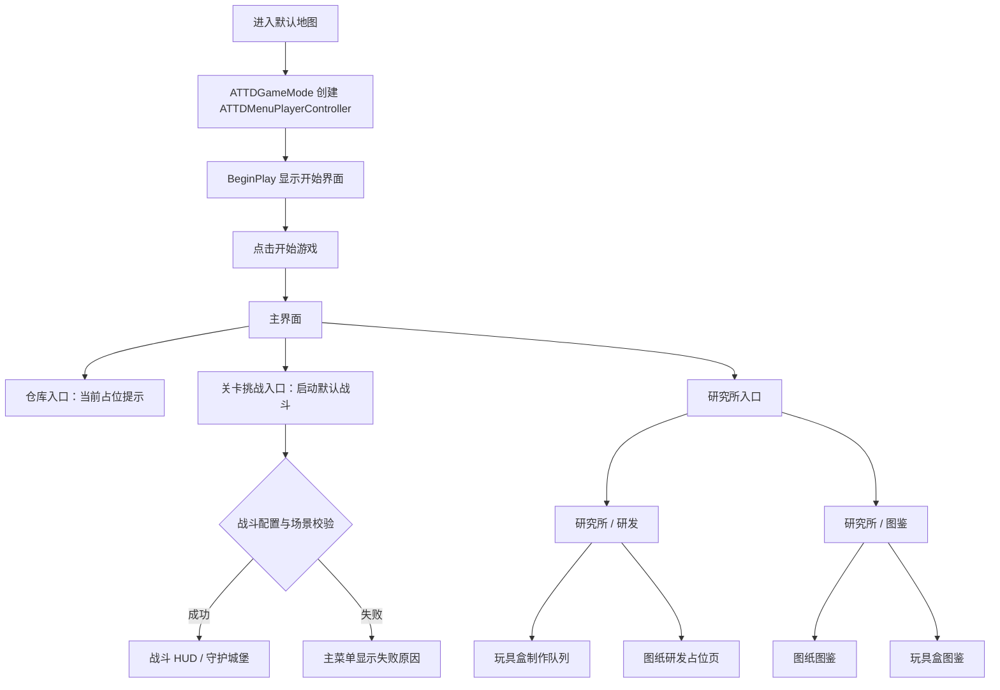
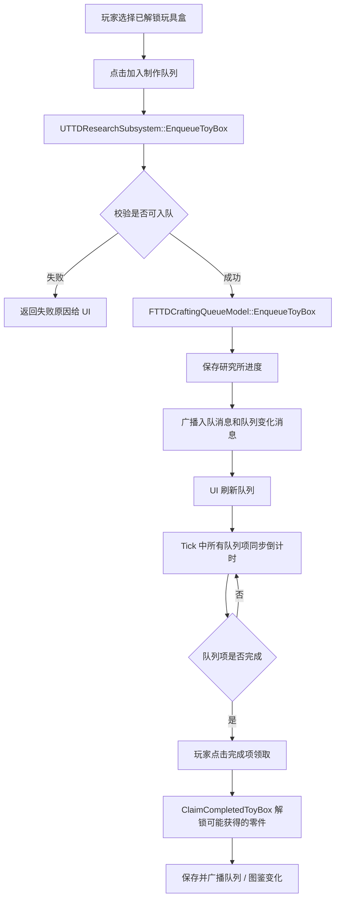
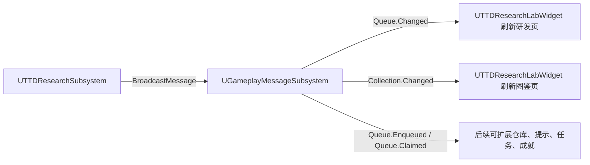

# ToyTowerDefense 项目使用逻辑与设计逻辑

## 1. 项目定位

`ToyTowerDefense` 当前是 UE5 C++ 塔防项目的阶段一原型，重点完成前置菜单、研究所、图鉴、玩具盒制作队列、存档、消息系统、全局对象池，以及首版“守护城堡”战斗闭环，为后续仓库、关卡选择、成长和正式关卡内容提供基础结构。

项目默认地图和默认 GameMode 在 `Config/DefaultEngine.ini` 中配置：

| 配置 | 当前值 | 说明 |
| --- | --- | --- |
| `GameDefaultMap` | `/Engine/Maps/Templates/OpenWorld` | 当前默认进入的地图 |
| `GlobalDefaultGameMode` | `/Script/ToyTowerDefense.TTDGameMode` | 使用项目自定义 GameMode |

`ATTDGameMode` 的主要职责是设置默认 `PlayerControllerClass` 为 `ATTDMenuPlayerController`，让游戏进入后自动走菜单 UI 流程。

## 2. 玩家使用流程

当前玩家侧流程已经包含菜单、研究所和首版关卡挑战入口：



对应代码入口：

| 文件 | 作用 |
| --- | --- |
| `Source/ToyTowerDefense/Private/TTDGameMode.cpp` | 指定 `ATTDMenuPlayerController` |
| `Source/ToyTowerDefense/Private/TTDMenuPlayerController.cpp` | 管理开始界面、主界面、研究所和战斗 HUD 切换 |
| `Source/ToyTowerDefense/Private/UI/TTDStartMenuWidget.cpp` | 开始界面，点击进入主界面 |
| `Source/ToyTowerDefense/Private/UI/TTDMainMenuWidget.cpp` | 主界面入口，研究所可跳转，关卡挑战会启动默认战斗，失败时显示原因 |
| `Source/ToyTowerDefense/Private/UI/TTDResearchLabWidget.cpp` | 研究所 UI，渲染图鉴、研发、队列和领取逻辑 |
| `Source/ToyTowerDefense/Private/UI/TTDBattleHUDWidget.cpp` | 战斗 HUD，显示状态、进度、城堡血量、货币、背包和建造入口 |

## 3. 研究所业务逻辑

研究所的运行时核心是 `UTTDResearchSubsystem`。它在 `Initialize` 中完成三件事：

1. 读取研究所定义数据。
2. 加载或创建研究所存档。
3. 根据上次保存时间补算离线制作进度。

### 3.1 图鉴逻辑

图鉴入口由 `UTTDResearchLabWidget::RenderAlmanac` 渲染。它支持两类内容：

| 图鉴分类 | 数据来源 | 解锁依据 | UI 行为 |
| --- | --- | --- | --- |
| 图纸 | `FTTDDiagramDefinition` | `UTTDSaveGame::UnlockedDiagramIds` | 已解锁可点击查看说明和所需零件 |
| 玩具盒 | `FTTDToyBoxDefinition` | `UTTDSaveGame::UnlockedToyBoxIds` | 已解锁可点击查看说明和可开出零件 |

`UTTDResearchSubsystem::GetCollectionEntries` 会把定义数据和存档中的解锁状态合并成 `FTTDCollectionEntry`，供 UI 统一消费。

### 3.2 玩具盒制作逻辑

玩具盒研发入口由 `UTTDResearchLabWidget::RenderResearch` 渲染。核心流程如下：



制作队列由 `FTTDCraftingQueueModel` 管理，保持为纯 C++ 模型，便于自动化测试。它负责：

- 队列容量限制。
- 入队时生成 `FGuid QueueId`。
- 所有未完成队列项同步倒计时。
- 完成后允许按 `QueueId` 领取。
- 过滤无效队列项。

### 3.3 存档逻辑

研究所存档结构是 `UTTDSaveGame`，当前保存以下内容：

| 字段 | 含义 |
| --- | --- |
| `UnlockedDiagramIds` | 已解锁图纸 ID |
| `UnlockedToyBoxIds` | 已解锁玩具盒 ID |
| `UnlockedPartIds` | 已解锁零件 ID |
| `CraftingQueue` | 当前制作队列 |
| `LastSavedUnixSeconds` | 上次保存时间，用于离线进度补算 |

新存档会从 `UTTDDeveloperSettings` 读取默认解锁图纸、玩具盒和零件。已有存档会直接加载队列，并在进入游戏时根据真实时间推进剩余制作时间。

## 4. 数据与配置设计

项目新增了自定义 `UTTDDeveloperSettings`，配置节位于 `Config/DefaultGame.ini`：

```ini
[/Script/ToyTowerDefense.TTDDeveloperSettings]
CraftingQueueMaxSlots=5
SaveSlotName=ToyTowerDefenseResearch
```

当前设置类的职责是把需要配置的项目参数收敛到一个入口，并支持用户希望的 `GameplayTag -> DataTable` 映射格式。新增玩法配置时优先添加 DataTable row struct、GameplayTag 常量，再通过 `UTTDDeveloperSettings.GameplayTagDataTables` 绑定实际资产。

| 配置项 | 用途 |
| --- | --- |
| `GameplayTagDataTables` | 用 GameplayTag 映射 DataTable |
| `CraftingQueueMaxSlots` | 制作队列最大槽位 |
| `SaveSlotName` | 研究所存档槽名称 |
| `DefaultUnlockedDiagramIds` | 新存档默认解锁图纸 |
| `DefaultUnlockedToyBoxIds` | 新存档默认解锁玩具盒 |
| `DefaultUnlockedPartIds` | 新存档默认解锁零件 |
| `DefaultBattleLevelId` | 主菜单“关卡挑战”默认启动的战斗关卡 ID |

当前已定义的 DataTable GameplayTag：

| GameplayTag | 行结构 | 说明 |
| --- | --- | --- |
| `TTD.DataTable.Research.Parts` | `FTTDPartDefinition` | 零件表 |
| `TTD.DataTable.Research.Diagrams` | `FTTDDiagramDefinition` | 图纸表 |
| `TTD.DataTable.Research.ToyBoxes` | `FTTDToyBoxDefinition` | 玩具盒表 |
| `TTD.DataTable.ObjectPool.Definitions` | `FTTDObjectPoolDefinition` | 对象池容量与扩容规则 |
| `TTD.DataTable.Battle.Levels` | `FTTDBattleLevelDefinition` | 战斗关卡入口、城堡、初始资源和波次列表 |
| `TTD.DataTable.Battle.Waves` | `FTTDWaveDefinition` | 波次敌人、数量、生成间隔和 SpawnGroup |
| `TTD.DataTable.Battle.Enemies` | `FTTDEnemyDefinition` | 敌人 class、血量、移速、攻击、进度权重和掉落 |
| `TTD.DataTable.Battle.Buildings` | `FTTDBuildingDefinition` | 建筑 class、图纸权限、零件消耗、攻击模式和基础属性 |
| `TTD.DataTable.Battle.ToyBoxRewards` | `FTTDToyBoxRewardDefinition` | 关卡内玩具盒价格、抽取次数和零件权重 |
| `TTD.DataTable.Battle.HeightEffects` | `FTTDBattleHeightEffectDefinition` | 高度效果器和属性修改器 |

研究所加载策略在 `UTTDResearchSubsystem::LoadDefinitionsFromSettings` 中实现：研究所初始化时先根据研究所 tag 从 `UTTDDeveloperSettings.GameplayTagDataTables` 找到对应 DataTable，再把每行转换成运行时定义数据。如果行结构不匹配或表为空，该类别当前会回退到 C++ 内置样例数据。

战斗加载策略在 `UTTDBattleWorldSubsystem::LoadDefinitionsFromSettings` 中实现：启动战斗时加载 Battle DataTable，并在启动前做显式校验。战斗表缺失、默认关卡不存在、Wave/Enemy 引用错误或场景缺少承载 Actor 时，`StartDefaultBattle(FText& OutFailureReason)` 会返回 `false`，不会清理已有战斗，也不会生成城堡或进入 HUD 假运行状态。

## 5. GameplayMessageRouter 设计

项目已经接入 Lyra 的 `GameplayMessageRouter` 插件，并在 `ToyTowerDefense.uproject` 中启用。游戏模块依赖 `GameplayTags` 和 `GameplayMessageRuntime`。

消息设计集中在 `TTDGameplayMessages`：

| Channel | Payload | 触发时机 |
| --- | --- | --- |
| `TTD.Message.Research.Queue.Changed` | `FTTDResearchQueueChangedMessage` | 队列变化、离线进度补算、制作完成、重置进度 |
| `TTD.Message.Research.Queue.Enqueued` | `FTTDToyBoxQueuedMessage` | 玩具盒成功加入制作队列 |
| `TTD.Message.Research.Queue.Claimed` | `FTTDToyBoxClaimedMessage` | 完成玩具盒被领取 |
| `TTD.Message.Research.Collection.Changed` | `FTTDResearchCollectionChangedMessage` | 零件或图鉴解锁状态变化 |
| `TTD.Message.Battle.State.Changed` | `FTTDBattleStateChangedMessage` | 战斗状态进入 Running、Victory、Defeat、ConfigurationError 等 |
| `TTD.Message.Battle.Progress.Changed` | `FTTDBattleProgressChangedMessage` | 剩余敌人权重或进度变化 |
| `TTD.Message.Battle.Currency.Changed` | `FTTDBattleCurrencyChangedMessage` | 关卡内货币变化 |
| `TTD.Message.Battle.Inventory.Changed` | `FTTDBattleInventoryChangedMessage` | 图纸、玩具盒或零件背包变化 |
| `TTD.Message.Battle.Building.Placed` | `FTTDBattleBuildingPlacedMessage` | 建筑成功放置到 BuildSlot |
| `TTD.Message.Battle.Ended` | `FTTDBattleEndedMessage` | 战斗结束，包含最终状态 |

当前消息流如下：



这样做的目的，是让研究所数据层不直接依赖具体 UI 或后续系统。后续仓库、任务、成就、引导、战斗前置检查等模块都可以通过监听 GameplayTag Channel 接入。

## 6. 全局对象池设计

项目新增 `UTTDObjectPoolWorldSubsystem` 作为每个 `UWorld` 内的全局对象池。它按 `Class` 管理对象，不按 GameplayTag 获取对象；只有实现 `UTTDPooledObjectInterface` 的 Actor 或 UObject 可以被池化。

对象池配置继续沿用 `UTTDDeveloperSettings + GameplayTag -> DataTable` 的项目规则：

| GameplayTag | 行结构 | 说明 |
| --- | --- | --- |
| `TTD.DataTable.ObjectPool.Definitions` | `FTTDObjectPoolDefinition` | 每类池化对象的容量与扩容规则 |

池化规则：

- 已配置 Class：按 `InitialSize` 预热，容量不足时按 `ExpandBy` 扩容，最多到 `MaxSize`。
- 已配置但达到 `MaxSize`：获取失败并返回空对象。
- 未配置 Class：如果实现池化接口，则临时创建，`bFromPool=false`，不进入池统计。
- 未实现接口的 Class：拒绝创建。
- Actor 回收时会隐藏、禁用碰撞和 Tick；再次获取时设置 Transform、显示、启用碰撞和 Tick。

业务侧入口：

- `AcquireObject`：获取任意实现池化接口的 UObject / Actor。
- `AcquireActor`：获取 Actor 子类，并应用 Transform。
- `ReleaseObject`：释放池化对象或临时对象。
- `PrewarmPool`：手动预热已配置 Class。
- `GetPoolStats`：查询指定 Class 的池统计。

池化接口 `UTTDPooledObjectInterface` 提供三个生命周期事件：

- `OnPoolCreated`：池创建实例时调用，适合做只需初始化一次的缓存。
- `OnAcquireFromPool`：对象被业务侧获取时调用，Actor 会先应用 Transform、显示、启用碰撞和 Tick。
- `OnReleaseToPool`：对象被释放时调用，Actor 随后会被隐藏、禁用碰撞和 Tick。

战斗系统中的敌人、建筑和投射物都按池化对象设计。未在对象池 DataTable 中配置时，只要类实现了池化接口，仍可临时创建并参与当前流程；如果配置了对象池并达到 `MaxSize`，获取会失败。战斗刷怪在运行时遇到这种失败会进入 `ConfigurationError`，不会把该敌人的权重从进度中扣掉。

## 7. 战斗首版闭环

首版战斗由 `UTTDBattleWorldSubsystem` 作为运行时中心，每个 `UWorld` 一份。主菜单“关卡挑战”调用 `StartDefaultBattle(FText& OutFailureReason)`，默认关卡 ID 来自 `UTTDDeveloperSettings.DefaultBattleLevelId`。

战斗目标是守护场景中心的城堡：

1. 启动时读取关卡配置，生成 `ATTDBattleCastleActor`。
2. 根据关卡 `WaveIds` 构建敌人 pending spawn 队列。
3. 敌人从场景中摆放的 `ATTDBattleSpawnPointActor` 生成，`SpawnGroup` 非空时只会选择同组刷怪点；`SpawnGroup` 为空时可使用任意刷怪点。
4. 敌人生成后寻找最近的我方目标，目前目标集合包含城堡和已建造建筑。
5. 所有波次刷完且场上敌人清空时胜利；城堡血量归零时失败。

战斗进度条使用敌人权重计算：

```text
Progress = 1 - (RemainingUnspawnedWeight + AliveEnemyWeight) / TotalEnemyWeight
```

这里的 `RemainingUnspawnedWeight` 表示尚未成功生成的敌人权重，`AliveEnemyWeight` 表示场上存活敌人权重。P0 修复后，敌人只有在 `SpawnEnemy` 成功后才会从 pending 队列移除并扣掉 `RemainingUnspawnedWeight`；如果对象池容量、配置或场景状态导致运行中生成失败，系统会进入 `ETTDBattleState::ConfigurationError`，冻结当前进度并广播 State/Ended，不会误判为 Victory。

建造使用场景中摆放的 `ATTDBuildSlotActor`：

- `SlotId` 用于消息和 UI 标识。
- `GridCoordinate` 和 `HeightLevel` 保留为格子数据。
- `HeightEffectId` 关联 `TTD.DataTable.Battle.HeightEffects`。
- 高度不限制建造；只有格子占用、图纸权限和零件数量会影响建造合法性。

建筑配置来自 `FTTDBuildingDefinition`。`RequiredDiagramId` 只作为权限校验，不消耗图纸；`PartCosts` 会消耗关卡内零件。建筑属性先使用 `BaseStats`，再按格子的 `HeightEffectId` 应用 `FTTDBattleAttributeModifier`，支持 `AttackDamage`、`AttackRange`、`AttackInterval`、`MaxHealth`、`ProjectileSpeed` 的 Add、Multiply、Override。

建筑攻击有两种模式：

- `InstantDamage`：按攻击间隔寻找范围内最近敌人并直接造成伤害。
- `Projectile`：通过对象池获取 `ATTDBattleProjectileActor`，初始化目标、伤害、速度和来源后飞向敌人。

投射物已经纳入战斗生命周期管理。`UTTDBattleWorldSubsystem` 维护 `ActiveProjectiles` 和递增的 `BattleInstanceId`；建筑发射投射物时注册到 Subsystem，投射物 Tick 时会检查自己的实例 ID 是否仍属于当前 Running 战斗。命中、目标失效、战斗结束或重开后实例不匹配时，投射物会注销并通过对象池释放，避免上一局投射物打到下一局目标。

关卡内玩具盒与零件由战斗 Subsystem 管理：

- `StartingDiagramIds`、`StartingToyBoxes`、`StartingParts`、`StartingCurrency` 来自关卡表。
- 敌人死亡会按 `CurrencyDrop` 增加货币。
- `BuyToyBox` 用货币购买玩具盒。
- `OpenToyBox` 按 `FTTDToyBoxRewardDefinition` 的权重、抽取次数和数量区间产出零件。

战斗启动前校验覆盖以下 P0 条件：

- 默认关卡 ID 非空且存在于 `TTD.DataTable.Battle.Levels`。
- 关卡引用的 Wave 存在。
- Wave 引用的 Enemy 存在；Enemy Class 为空时使用默认 `ATTDBattleEnemyActor`，非空时必须是实现池化接口的 `ATTDBattleEnemyActor` 派生类。
- 每个 Wave 使用的 `SpawnGroup` 至少有一个对应 SpawnPoint；空 SpawnGroup 允许任意 SpawnPoint，但场景至少要有一个 SpawnPoint。
- 场景至少有一个 BuildSlot。
- Projectile 建筑配置的 ProjectileClass 必须是实现池化接口的 `ATTDBattleProjectileActor` 派生类；为空时使用默认投射物。

## 8. 核心类职责

| 类/结构 | 文件 | 职责 |
| --- | --- | --- |
| `ATTDGameMode` | `Source/ToyTowerDefense/Public/TTDGameMode.h` | 设置默认菜单 PlayerController |
| `ATTDMenuPlayerController` | `Source/ToyTowerDefense/Public/TTDMenuPlayerController.h` | 统一管理菜单 Widget 切换 |
| `UTTDStartMenuWidget` | `Source/ToyTowerDefense/Public/UI/TTDStartMenuWidget.h` | 开始界面 |
| `UTTDMainMenuWidget` | `Source/ToyTowerDefense/Public/UI/TTDMainMenuWidget.h` | 主界面入口 |
| `UTTDResearchLabWidget` | `Source/ToyTowerDefense/Public/UI/TTDResearchLabWidget.h` | 研究所 UI、图鉴、制作队列交互 |
| `UTTDResearchSubsystem` | `Source/ToyTowerDefense/Public/TTDResearchSubsystem.h` | 研究所运行时数据中心 |
| `FTTDCraftingQueueModel` | `Source/ToyTowerDefense/Public/TTDCraftingQueueModel.h` | 纯 C++ 制作队列模型 |
| `UTTDSaveGame` | `Source/ToyTowerDefense/Public/TTDSaveGame.h` | 研究所存档 |
| `UTTDDeveloperSettings` | `Source/ToyTowerDefense/Public/TTDDeveloperSettings.h` | 项目配置入口 |
| `TTDGameplayTags` | `Source/ToyTowerDefense/Public/TTDGameplayTags.h` | DataTable GameplayTag 定义 |
| `TTDGameplayMessages` | `Source/ToyTowerDefense/Public/TTDGameplayMessages.h` | 消息 channel 和 payload 定义 |
| `UTTDObjectPoolWorldSubsystem` | `Source/ToyTowerDefense/Public/TTDObjectPoolWorldSubsystem.h` | 全局对象池入口 |
| `UTTDPooledObjectInterface` | `Source/ToyTowerDefense/Public/TTDPooledObjectInterface.h` | 池化对象生命周期接口 |
| `UTTDBattleWorldSubsystem` | `Source/ToyTowerDefense/Public/TTDBattleWorldSubsystem.h` | 战斗运行时中心、启动校验、波次、建造、背包、进度和胜负 |
| `ATTDBattleCastleActor` | `Source/ToyTowerDefense/Public/Battle/TTDBattleCastleActor.h` | 城堡核心目标 |
| `ATTDBattleEnemyActor` | `Source/ToyTowerDefense/Public/Battle/TTDBattleEnemyActor.h` | 池化敌人、索敌、攻击和死亡通知 |
| `ATTDBattleBuildingActor` | `Source/ToyTowerDefense/Public/Battle/TTDBattleBuildingActor.h` | 建筑目标和攻击行为 |
| `ATTDBattleProjectileActor` | `Source/ToyTowerDefense/Public/Battle/TTDBattleProjectileActor.h` | 池化投射物、命中和战斗实例校验 |
| `ATTDBattleSpawnPointActor` | `Source/ToyTowerDefense/Public/Battle/TTDBattleSpawnPointActor.h` | 场景刷怪点和 SpawnGroup |
| `ATTDBuildSlotActor` | `Source/ToyTowerDefense/Public/Battle/TTDBuildSlotActor.h` | 场景建造格、占用状态和高度效果入口 |

## 9. 当前测试覆盖

项目当前自动化测试覆盖：

| 测试名 | 覆盖内容 |
| --- | --- |
| `ToyTowerDefense.Research.CraftingQueueModel` | 制作队列入队、容量、同步倒计时、完成领取 |
| `ToyTowerDefense.Settings.DeveloperSettings` | DeveloperSettings 注册、DataTable tag 槽位、队列容量配置 |
| `ToyTowerDefense.Messaging.GameplayMessageRouter` | GameplayMessageRouter 可用性、监听与 payload 传递 |
| `ToyTowerDefense.ObjectPool.WorldSubsystem` | 对象池预热、复用、扩容、容量上限、临时对象、Actor Transform |
| `ToyTowerDefense.Battle.WorldSubsystem` | 战斗启动校验、进度权重、敌人死亡、建造校验、高度效果器、玩具盒、即时伤害、投射物、P0 配置错误 |

常用验证命令：

```powershell
E:\UE\SourceEngine\Engine\Build\BatchFiles\Build.bat ToyTowerDefenseEditor Win64 Development -Project=E:\Github\ToyTower\ToyTowerDefense\ToyTowerDefense.uproject -WaitMutex -NoHotReloadFromIDE
```

```powershell
E:\UE\SourceEngine\Engine\Binaries\Win64\UnrealEditor-Cmd.exe E:\Github\ToyTower\ToyTowerDefense\ToyTowerDefense.uproject -unattended -nop4 -nosplash -NullRHI -NoSound -ExecCmds="Automation RunTests ToyTowerDefense; Quit" -TestExit="Automation Test Queue Empty"
```

## 10. 当前边界与后续建议

已完成的基础能力：

- 菜单流转闭环。
- 研究所图鉴展示。
- 玩具盒制作队列。
- 存档与离线制作补算。
- DeveloperSettings 配置入口。
- `GameplayTag -> DataTable` 数据表结构入口。
- GameplayMessageRouter 消息广播与 UI 监听。
- 全局对象池与池化接口。
- 首版守护城堡战斗闭环。
- 队列、设置、消息、对象池、战斗自动化测试。

仍需推进的内容：

- `DefaultGame.ini` 当前尚未配置实际 DataTable 资产路径；研究所仍可能依赖 C++ 内置样例数据，战斗会在缺少配置或场景承载时显式启动失败。
- `UTTDResearchSubsystem::SeedDefinitions` 中仍保留核心玩法样例数据，建议迁入 DataTable。
- 自动保存间隔、默认选中玩具盒、UI 刷新间隔、图鉴列数仍是硬编码。
- UI 文案和样式当前写在 C++ Widget 中，后续建议迁到 StringTable、DataTable 或 Widget Blueprint。
- 图纸研发和仓库仍是占位入口，需要补充玩法规则后再接入。
- 战斗目前使用场景预设 SpawnPoint / BuildSlot 和直线索敌移动，后续可替换为正式地图、关卡选择、NavMesh 或格子寻路。
- 对象池代码已接入，项目内容侧还需要创建实际对象池 DataTable 资产。
- P1/P2 待处理项包括 RowName/Id 规范、BlueprintNativeEvent 调度方式、消息监听初始状态、目标策略和高速投射物命中算法。
- 文档中的“队列最多 5 个槽位”和“研究所内置样例数据兜底”描述，应在配置化完成后同步更新。

## 11. 关键阅读路径

如果新成员要快速理解项目，可以按这个顺序读：

1. `docs/需求整理.md`
2. `docs/方案设计.md`
3. `Config/DefaultEngine.ini`
4. `Config/DefaultGame.ini`
5. `Source/ToyTowerDefense/Private/TTDGameMode.cpp`
6. `Source/ToyTowerDefense/Private/TTDMenuPlayerController.cpp`
7. `Source/ToyTowerDefense/Private/UI/TTDResearchLabWidget.cpp`
8. `Source/ToyTowerDefense/Private/TTDResearchSubsystem.cpp`
9. `Source/ToyTowerDefense/Public/TTDTypes.h`
10. `Source/ToyTowerDefense/Public/TTDDeveloperSettings.h`
11. `Source/ToyTowerDefense/Public/TTDGameplayMessages.h`
12. `Source/ToyTowerDefense/Public/TTDObjectPoolWorldSubsystem.h`
13. `Source/ToyTowerDefense/Public/TTDBattleWorldSubsystem.h`
14. `Source/ToyTowerDefense/Public/TTDBattleTypes.h`
15. `Source/ToyTowerDefense/Public/Battle`
16. `Source/ToyTowerDefense/Private/Tests`
